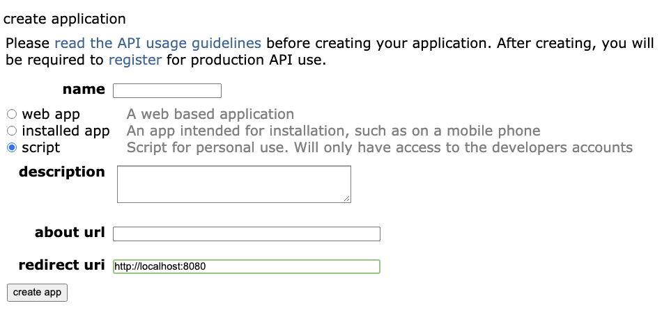

### A repo to try out web scraping using an API


Following this tutorial with modifications --> https://www.storybench.org/how-to-scrape-reddit-with-python/
Modifications:
- Usage of Python  Modules
- Pyspark for loading and cleaning


#### Setup your environment:

``` shell
# create an virtual env
conda create -n webscrape python=3.8
# activate this venv
conda activate webscrape


# install packages 
pip install -f requirements.txt
# or
pip install pandas praw python-dotenv

```

#### To update requirements.txt: 

See this link for details (current bug with pip 20.1) https://stackoverflow.com/questions/62885911/pip-freeze-creates-some-weird-path-instead-of-the-package-version

```
pip list --format=freeze > requirements.txt
```

Register an app under the following link:
https://www.reddit.com/prefs/apps




Create a file called .env and fill in the following variables:
```
SCRIPT=
SECRET=
APP_NAME=
REDDIT_USERNAME=
REDDIT_PASSWORD=
```
If Edit Mode is not required -- Username and Password is not required


Run the code 
```
# change necessary inputs in main function
python main.py
```